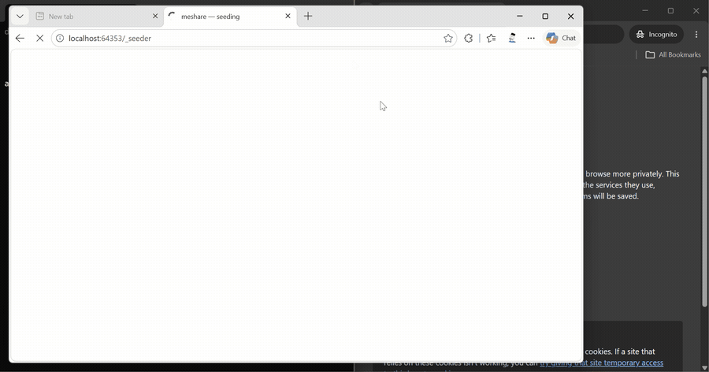

# meshare

**P2P file sharing where the viewers become the servers.**

Share a file with one command. Everyone who opens the link downloads it browser-to-browser — no account, no install, no upload to a server — and instantly becomes a seeder for the next person. The original sender can go offline; the file lives on in the swarm.



> `meshare site ./examples/bounce-demo` → link + QR appear instantly → a fresh browser downloads it peer-to-peer (hash-verified) and opens the game **full-screen, nothing installed**.

### Quick start

```bash
npx meshare ./file          # share any file, peer-to-peer
meshare site ./my-folder    # host a static site or game, peer-to-peer
```

Send the link it prints — whoever opens it needs nothing installed, and their browser becomes a server for the next person too.

## The demo that explains everything

1. `npx meshare ./file` → you get a link + QR, and a seeder tab opens.
2. Send the link to anyone. They click it. The file downloads straight from your machine over WebRTC — they install nothing.
3. Their browser is now a seeder too (watch your terminal count them).
4. **Close your terminal and seeder tab.** Send the link to a third person. It still works — served by recipient #2.
5. Recipient #2 closes their tab and reopens it tomorrow: their copy re-seeds instantly from local cache, no re-download.

## Install & use

```bash
npx meshare <file>              # zero-install, or:
npm i -g meshare && meshare <file>
```

```
meshare <file>                     share (random link, expires in 7 days)
meshare <file> --name launch-kit   human-readable link: …/#launch-kit
meshare <file> --expires 3         custom expiry in days
meshare <file> --password s3cret   password-protect the share
meshare site <folder>              host a small static site/game, P2P (same flags)
meshare revoke <id>                kill one of your links, for everyone
```

### P2P site hosting (new)

`meshare site ./my-game` bundles a folder (≤20 MB), hashes every file, and serves it through the same mesh. Visitors click the link, the bundle arrives peer-to-peer, **every file's SHA-256 is verified before a single line runs**, and the site executes in a sandboxed frame with no access to visitor data. Every visitor seeds the site to the next one. Try the included example: `meshare site ./examples/bounce-demo`.

v1 scope, honestly: single-page sites and games with directly-referenced assets (scripts, styles, images, audio) work; sites that `fetch()` their own files at runtime or use routing need the service-worker serving mode on the roadmap.

No CLI? Open the [web app](https://meshare.meshareapp.workers.dev), pick a file, get a link — sharing works entirely in the browser too.

## What's actually shipped

| Feature | Notes |
|---|---|
| Direct P2P transfer | WebRTC data channels via PeerJS; byte-count verified with receiver acks |
| TURN relay fallback | Automatic when direct connection fails (strict NATs); short-lived credentials minted server-side — no secrets in any page |
| Multi-seeder mesh | Up to 8 seeders per file; downloaders auto-register as seeders; vacated slots self-heal |
| Large-file streaming | Sender reads chunks from disk on demand; receiver can stream to disk (File System Access API, with in-memory fallback); 500 MB tested at ~26 MB peak RAM |
| Offline cache + instant re-seed | Received/shared files persist in IndexedDB; reopening the page re-seeds in ~1 s with no re-download |
| PWA | Installable on desktop/Android; app shell loads offline |
| Custom named links | `--name`, collision detection with suggestions; revoked names are permanently retired (no link hijacking) |
| Expiry / revocation | Enforced by the registry Worker; live seeders poll and stand down when a share is killed |
| Password protection | Shared-secret gate enforced at both the mesh layer and the registry |
| Rate limiting | Durable (cross-isolate) per-IP limits on registration, uploads, downloads, and credential minting |
| P2P site hosting (v1) | `meshare site ./folder` — hash-verified bundles, sandboxed execution, visitors become mirrors |

## Experimental: live rooms (`live/room.html`)

A preview of real-time, serverless rooms. Everyone who opens the same room name connects **directly** to each other (full mesh, reusing the seeder-slot discovery pattern) for live **presence + chat** — no server stores a byte. Verified with 3 peers: presence, chat broadcast, and clean leave all sync.

Honest scope: **ephemeral** — state is alive only while people are present and gone when the room empties (browser-pure P2P can't persist a room with nobody in it — every "decentralized" chat quietly runs relay servers for that). Best for ≤8 peers. Conflict-free shared *documents* (collaborative editing) would need a CRDT layer (Yjs) on top of this — not built yet.

## Known limitations — read before relying on it

- **A fully closed tab cannot seed.** WebRTC only exists in open pages; no service worker can change that (browser platform constraint, not a bug). meshare's answer is instant re-seeding from cache when a tab reopens — not background seeding, which the web platform does not permit.
- **No backup storage yet.** If *every* seeder is offline at the same moment, the file is unavailable until one comes back. Cloud backup (R2) is designed and code-complete but deliberately not enabled yet.
- **Signaling depends on PeerJS's free public server** — no uptime SLA. It has been reliable in our testing, but it's a shared third-party service.
- **Relay quota:** transfers through the TURN relay (strict-NAT cases only) share a free 500 MB/month pool; direct transfers are unmetered.
- **Password ≠ encryption at rest.** Transfers are encrypted in transit (WebRTC DTLS), and the password gates access — but anyone who has both link and password can download, and revocation cannot recall copies already downloaded. Same physics as any P2P system.
- **Big files in the web app live in memory** (needed for re-seeding). For multi-GB files, prefer the CLI on the sending side; receivers get a stream-to-disk option.
- Max 8 simultaneous seeders per file; recipients download from one seeder at a time (no swarming).

## Architecture (short version)

```
CLI ──serves file──▶ local seeder tab ──WebRTC──▶ recipient browser ──▶ next recipient…
                          │                            │
                          └──── PeerJS cloud signaling ┘
   Cloudflare Worker #1: static app + share registry (names/expiry/revoke/passwords, KV)
   Cloudflare Worker #2: short-lived TURN credentials (Metered.ca, secret server-side)
```

Seeders claim deterministic peer IDs (`meshare-<fileId>-<n>`); joiners probe slots in order and download from the first responder — discovery with zero registry involvement in the transfer path.

## Development

```bash
git clone https://github.com/HassanNadeem1122/meshare
# web app:   app/public/index.html  (deploy: cd app && npx wrangler deploy)
# registry:  app/src/worker.js
# CLI:       cli/cli.js + cli/seeder.html   (npm link to test locally)
# legacy demos from early stages: sender.html, receiver.html, mesh.html
```

You'll need your own Cloudflare account (Workers + KV, free tier) and a Metered.ca account (free tier) for TURN if you self-deploy; the URLs live at the top of the client files.

## License

MIT © Hassan Nadeem
